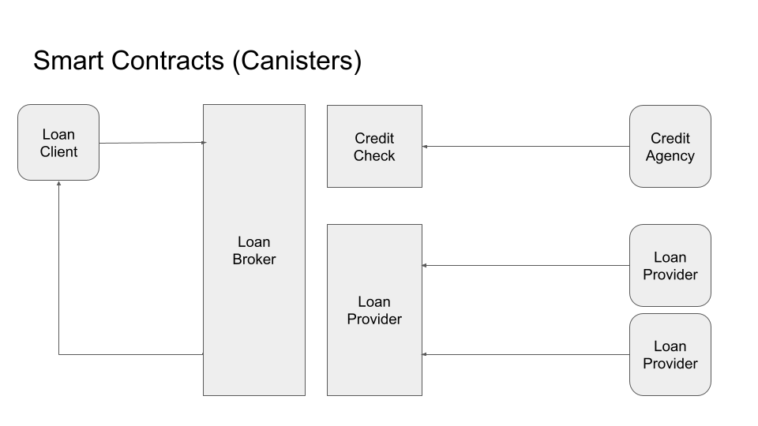
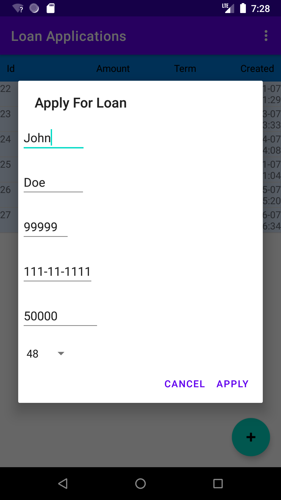
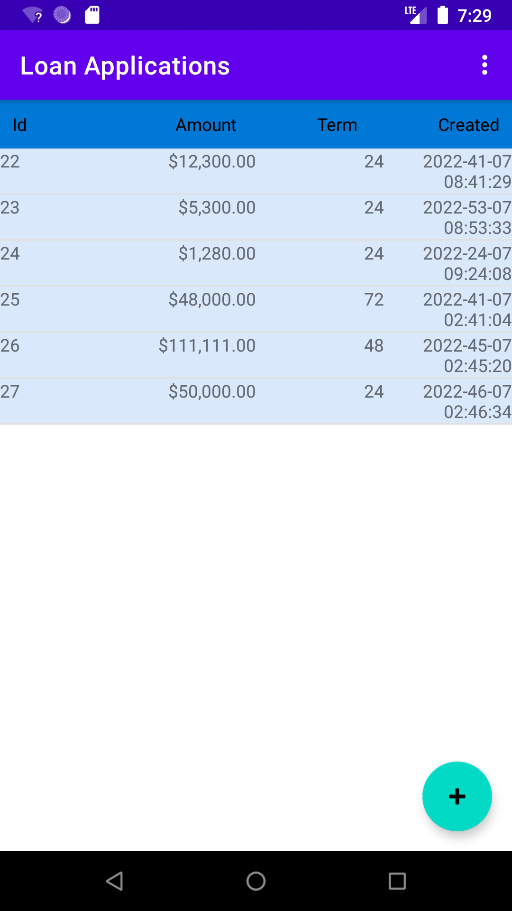
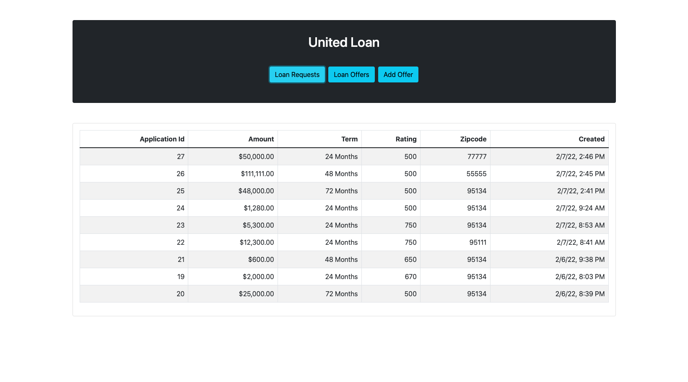
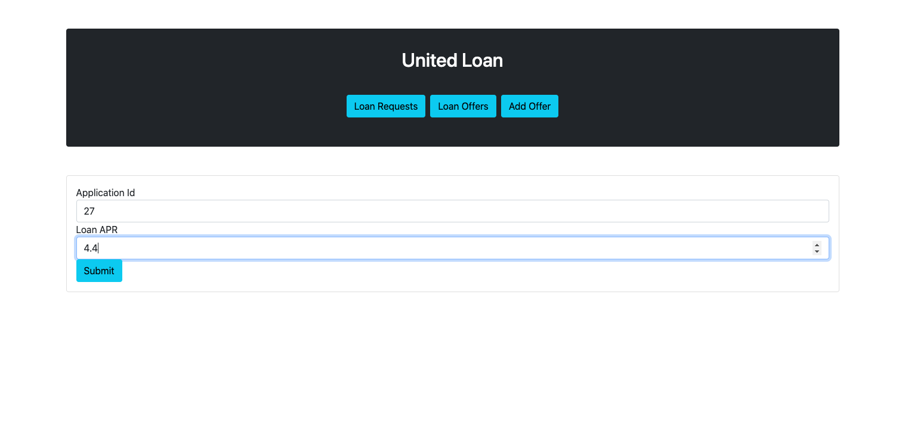
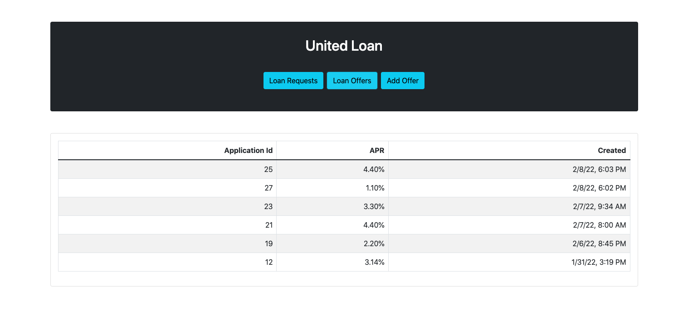
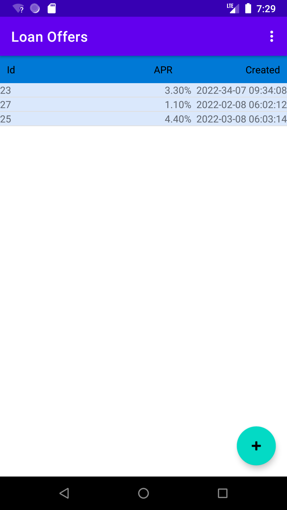

# LoanFlow
Demo demonstrating various integration scenarios between the IC and Java using IC4J library

The process consists of 3 canisters, orchestrating smart contracts of 3 parties 
(Loan Client, Credit Check Agency and multiple competing Loan Providers). 

For Loan Client we developed native Java Android application where the user can apply for a loan, review pending loan applications and offers. 
The application calls methods in LoanBroker Motoko canister to insert and query data.

 

Loan Broker canister then orchestrates loan process, first sends request to CreditCheck canister to assign credit rating to the application. Credit check is processed by Java batch process that retrieves simulated credit data from JDBC database.

After the rating is assigned, Loan Broker application forwards the offer request to multiple subscribed Loan Provider canisters. Requests there are processed in Java Spring/Angular based  dashboard application , where loan agents can review requests and assign APR. 
  
      

 

  

The client can then review the offer again in the Android app.     

          

